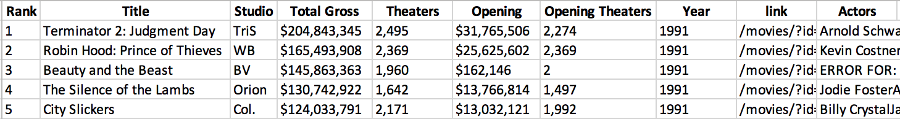
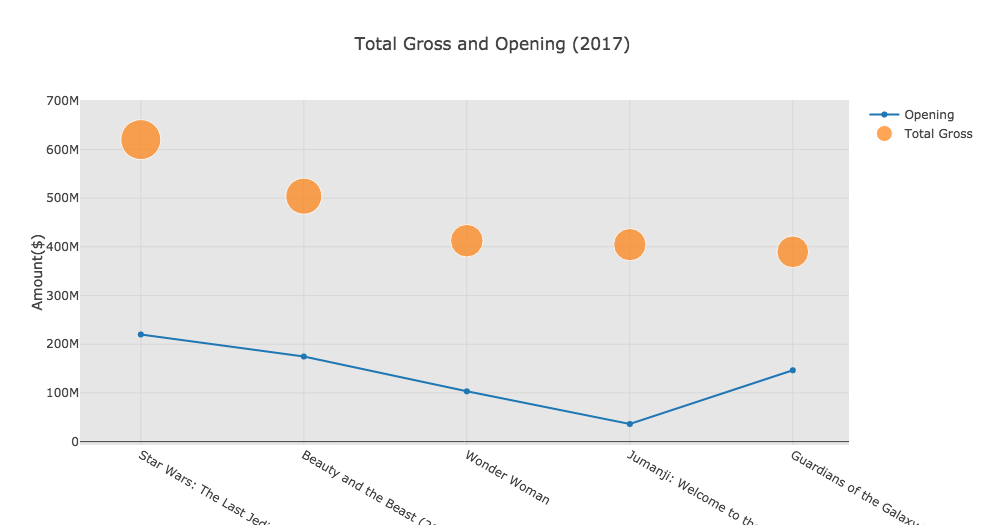

<h1 align="center"> Beauty And The Beast Analysis </h1> 
<p align="center"> 
How the New 'Beauty and the Beast' Compares to the Animated Classic 
</p>

<div align="center">
❤︎
</div>

<p align="center">
  <a href="#background">Background</a> •
  <a href="#requirement">Requirement</a> •
  <a href="#movie-data">Movie Data</a> •
  <a href="#analysis">Analysis</a> •
  <a href="#technology-stack-used">Technology Stack Used</a> •
  <a href="#can-we-go-further">Can We Go Further</a>
</p>


## Background
Once Walt Disney Pictures began adapting its animated classics for live-action, starting with Tim Burton’s 2010 take on Alice in Wonderland and moving into villain-centered fairy tales like Maleficent, it was a safe bet that a new version of **Beauty and the Beast** wouldn’t be too far behind. The 1991 film is beloved the world over and was a central part of pop culture for countless Millennials growing up. Plus, it garnered heaps of critical praise and a Best Picture nomination at the Oscars, the first for an animated film. So it’s no surprise that Disney has gone all-in with its live-action remake of Beauty and the Beast: it boasts an all-star cast including **Emma Watson**, **Dan Stevens**, **Ewan McGregor**, **Ian McKellen**, **Luke Evans**, and more; its director, **Bill Condon**, has directed everything from entries in the Twilight Saga to the Dreamgirls musical adaptation; and its reported $160 million budget is evident in the sets, costumes, and extensive CGI. [[1]](#reference)

---

## Requirement
> You may need Plotly, BeautifulSoup installed.
```python
# Plotly
pip install plotly
# BeautifulSoup
pip install bs4
```
---


## Movie Data
The movie data for both movies are scrapped from [boxofficemojo](http://www.boxofficemojo.com/).
The years we selected are from 1980 to 2018.

**Python Scrape Code Preview**
```python
all_years = []
for x in range(1980,2018):
    all_years.append(box_office_mojo_compile(x))
all_year = pd.concat(all_years)
```

**Data Preview**




>You can find all cleaned data at [here](https://github.com/yycyjqc/Beauty_And_The_Beast_Analysis/tree/master/dataset).

---

## Analysis
Let's start with total gross and opening.
[](https://github.com/yycyjqc/Beauty_And_The_Beast_Analysis/blob/master/result_img/Total_Gross_vs_Opening_1991.png)
<br>
</br>
[](https://github.com/yycyjqc/Beauty_And_The_Beast_Analysis/blob/master/result_img/Total_Gross_vs_Opening_2017.png)
<br>
</br>
Those two plots show the top five movies in year 1991 and year 2017. It is interesting to see the Beauty 1991 almost had $0 at opening. The reason I found for that is because only two theaters open at the first week.

Also, it's easy to see the rank of top movies is based on the total gross. 


[](https://github.com/yycyjqc/Beauty_And_The_Beast_Analysis/blob/master/result_img/Weekend_Gross_1991.png)
<br>
</br>
It only had two theaters open at the first week, I decide to remove week one data because it was not comparable.

Compared with year 1991 (see the chart below), according to Box Office: 'Beauty and the Beast' smashed records with towering $175 Million debut. 
>This is what makes Disney such a powerhouse.

What we could find is both movies were very hot at the first few weeks. 2017 vision kept going down heavyly, after three months, the data was even too small to see one the chart. However, Beauty 1991 hit the highest weekend gross at the week two, and the topic was still very hot until week ten. After that, the point remained around $1,900,000 until the end of the period.

[](https://github.com/yycyjqc/Beauty_And_The_Beast_Analysis/blob/master/result_img/Weekend_Gross_2017.png)
<br>
</br>


---


## Technology Stack Used
+ Python
+ Plotly (Visualization)
+ BeautifulSoup (Web Scraping)
+ Seaborn/Matplotlib (Visualization)

---

## Can We Go Further
+ The dataset is very big with over ten categories. It might have huge potential behind the data.
+ Besides <Beauty and the Beast>, we can calculate the total amount of revenue for each studio yearly, decadely, even accumulated, to see the market share of each movie studio of US market.
+ The correlation between total gross and theaters open.
+ ......
> You might see another repository about the deeply analysis shortly.


---


## Reference
Josh Spiegel, (March 20th, 2017). *[How the New ‘Beauty and the Beast’ Compares to the Animated Classic](http://www.slashfilm.com/beauty-and-the-beast-compared-to-the-original/)*
