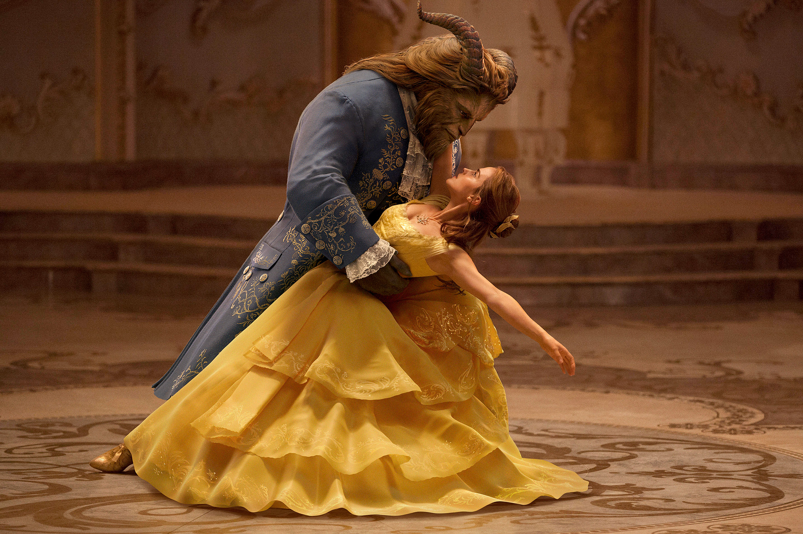
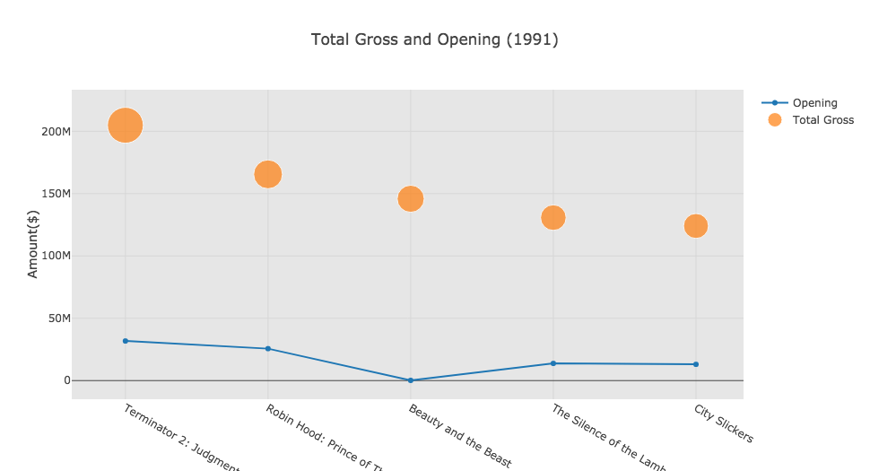
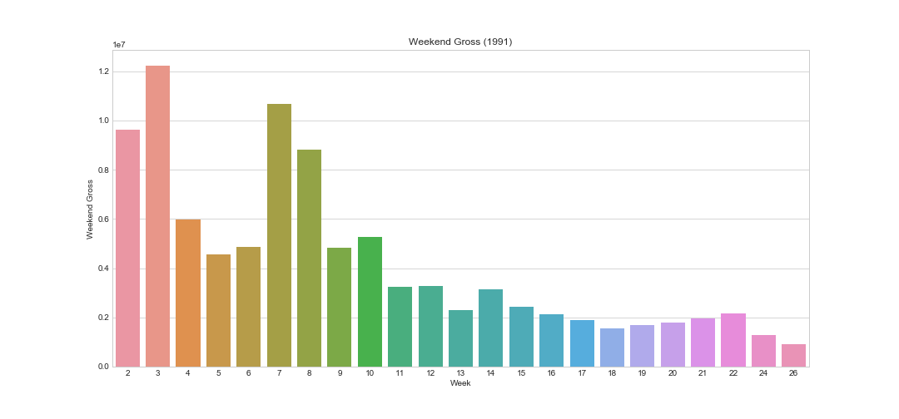
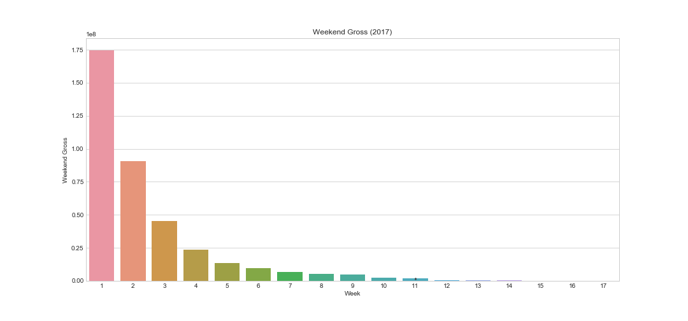

<h1 align="center"> Beauty And The Beast Analysis </h1> 
<p align="center"> 
How the New 'Beauty and the Beast' Compares to the Animated Classic 
</p>

<div align="center">
❤︎
</div>

<p align="center">
  <a href="#background">Background</a> •
  <a href="#requirement">Requirement</a> •
  <a href="#movie-data">Movie Data</a> •
  <a href="#analysis">Analysis</a> •
  <a href="#technology-stack-used">Technology Stack Used</a>
</p>



## Background
Once Walt Disney Pictures began adapting its animated classics for live-action, starting with Tim Burton’s 2010 take on Alice in Wonderland and moving into villain-centered fairy tales like Maleficent, it was a safe bet that a new version of **Beauty and the Beast** wouldn’t be too far behind. The 1991 film is beloved the world over and was a central part of pop culture for countless Millennials growing up. Plus, it garnered heaps of critical praise and a Best Picture nomination at the Oscars, the first for an animated film. So it’s no surprise that Disney has gone all-in with its live-action remake of Beauty and the Beast: it boasts an all-star cast including **Emma Watson**, **Dan Stevens**, **Ewan McGregor**, **Ian McKellen**, **Luke Evans**, and more; its director, **Bill Condon**, has directed everything from entries in the Twilight Saga to the Dreamgirls musical adaptation; and its reported $160 million budget is evident in the sets, costumes, and extensive CGI. [[1]](#reference)

---

## Requirement
> You may need Plotly, BeautifulSoup installed.
```bash
# Plotly
pip install plotly
# BeautifulSoup
pip install bs4
```


## Movie Data
The movie data for both movies are scrapped from [boxofficemojo](http://www.boxofficemojo.com/).
The years we selected are from 1980 to 2018.

```bash
all_years = []
for x in range(1980,2018):
    all_years.append(box_office_mojo_compile(x))
all_year = pd.concat(all_years)
```

>You can find all cleaned data at [here](https://github.com/yycyjqc/Beauty_And_The_Beast_Analysis/tree/master/dataset).

---


## Analysis
Let's start with total gross and opening.
[](https://github.com/yycyjqc/Beauty_And_The_Beast_Analysis/blob/master/result_img/Total_Gross_vs_Opening.png)
[](https://github.com/yycyjqc/Beauty_And_The_Beast_Analysis/blob/master/result_img/Weekend_Gross_1991.png)
[](https://github.com/yycyjqc/Beauty_And_The_Beast_Analysis/blob/master/result_img/Weekend_Gross_2017.png)

## Technology Stack Used
+ Python
+ Plotly (Visualization)
+ BeautifulSoup (Web Scraping)
+ Seaborn/Matplotlib (Visualization)

## Reference
Josh Spiegel, (March 20th, 2017). *[How the New ‘Beauty and the Beast’ Compares to the Animated Classic](http://www.slashfilm.com/beauty-and-the-beast-compared-to-the-original/)*
