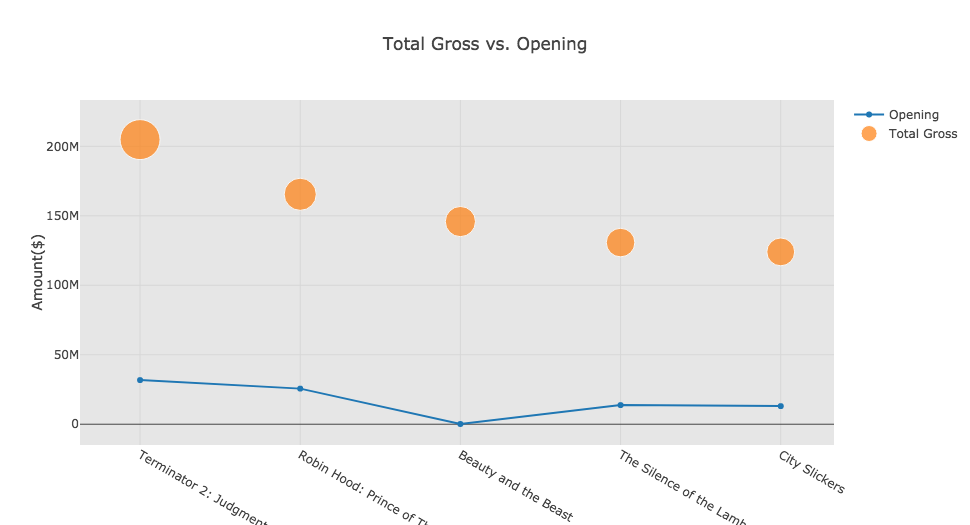

<h1 align="center"> Beauty And The Beast Analysis </h1> 

 
How the New 'Beauty and the Beast' Compares to the Animated Classic 

❤︎

<h1 align="center"> [Background](#background) | [Movie](#movie) | [Music](#music) | [Analysis](#analysis) | [Technology Stack Used](#technology-stack-used) | [Reference](#reference)  </h1> 

 
 

## Background
Once Walt Disney Pictures began adapting its animated classics for live-action, starting with Tim Burton’s 2010 take on Alice in Wonderland and moving into villain-centered fairy tales like Maleficent, it was a safe bet that a new version of **Beauty and the Beast** wouldn’t be too far behind. The 1991 film is beloved the world over and was a central part of pop culture for countless Millennials growing up. Plus, it garnered heaps of critical praise and a Best Picture nomination at the Oscars, the first for an animated film. So it’s no surprise that Disney has gone all-in with its live-action remake of Beauty and the Beast: it boasts an all-star cast including **Emma Watson**, **Dan Stevens**, **Ewan McGregor**, **Ian McKellen**, **Luke Evans**, and more; its director, **Bill Condon**, has directed everything from entries in the Twilight Saga to the Dreamgirls musical adaptation; and its reported $160 million budget is evident in the sets, costumes, and extensive CGI. [[1]](#reference)

---

## Movie

---

## Music
---

## Analysis

---

## Technology Stack Used
---

## Reference
Josh Spiegel, (March 20th, 2017). *[How the New ‘Beauty and the Beast’ Compares to the Animated Classic](http://www.slashfilm.com/beauty-and-the-beast-compared-to-the-original/)*
